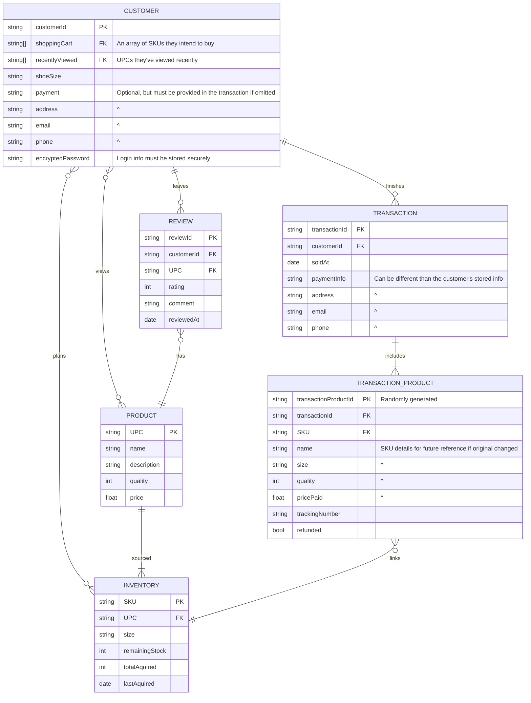

# Database Design - Nike Shoe Store
The following model describes the relationships between the customer, a transaction, a product, and inventory within a Nike store.

This model takes 6 systems into account, namely `customers`, `products`, `inventory`, `transactions`, `products in transactions`, and `reviews`.

`CUSTOMER`s are the source of traffic and income for the store. They need to be able to view products in order to determine if they want to make a purchase or not. Customers expect to, at the very least, be able to:
- buy multiple items or store items in a shopping cart
- create an account and store their information safely
- select their shoe size, and perhaps save it for future use
- see past purchases
- get a refund on an individual item if needed
- leave a review

While slightly out of scope, `REVIEW`s are still needed for customers to have confidence in their purchase. They need to, at the very least, be tied to an account and have a star rating and comment about the product.

Without `PRODUCT`s, customers don't have a reason to use a store. Products need to have a name, a good description, possibly the quality if the product is used, and how much the item goes for.

People have differing shoe sizes, and the business needs a way to differentiate them. This is where the `PRODUCT sourced INVENTORY` relationship comes in. `INVENTORY` stores each size of each product as a SKU, along with how many are in stock and which product it's associated with. Some additional details for the employees are included for the purpose of buying new stock. Via this relationship, different sizes are shown under the same product page.

The relationship `CUSTOMER views PRODUCT` allows the customer to view as many products as they want. These products are automatically stored in the customer's data in order to help the customer find them again, possibly increasing sales. They're also able to add them to their shopping cart with `CUSTOMER plans INVENTORY`, as cart items reference the SKU. Customers are also able see the reviews on products via the `PRODUCT has REVIEW` relationship. 

When a customer completes their purchase through `CUSTOMER places TRANSACTION`, they receive a receipt as proof of purchase. The company needs to keep a receipt on their end as well, and this takes the form of a `TRANSACTION`. It's also linked to the customer so that the customer can view their prior transactions. Information specific to that transaction is recorded, such as the payment information, shipping address, and contact info.

Since prices and product names can change over time, these need to be recorded for this receipt. The shipment tracking code and SKU are all recorded as well since they can be different across items purchased. These are stored in `TRANSACTION_PRODUCT` and are linked by the `TRANSACTION includes TRANSACTION_PRODUCT` relationship. For employees, `TRANSACTION_PRODUCT links INVENTORY` allows for them to look at the original inventory item in order to better process returns, providing the listing hasn't changed.

Once the customer has bought a product, they're able to add a review to that product via the `CUSTOMER leaves REVIEW` relationship. Customers are also able to see all of their own reviews for different products since reviews are linked to the product and customer.